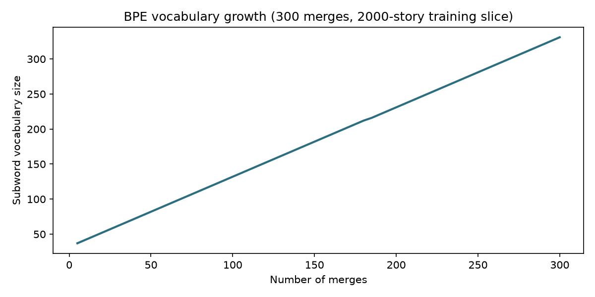
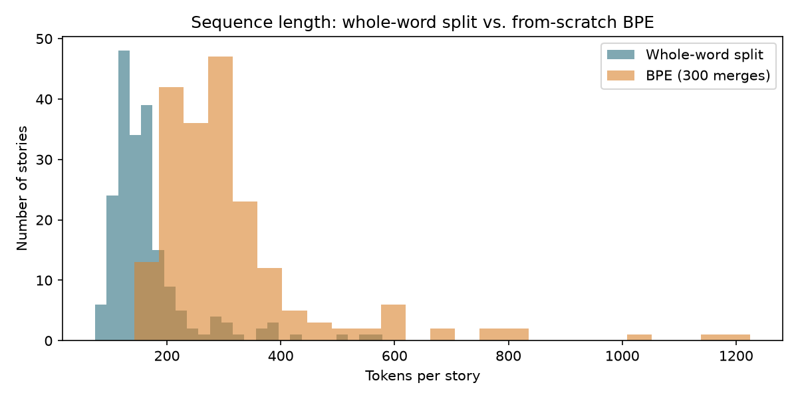

# From Scratch to Agents
## Module 00 — Setup & Real Data
### Episode 00.02: Building a Tokenizer From Scratch
 
---
 
## 0. Where we're starting from
 
Episode 00.01 loaded real TinyStories text three ways and closed on a quiet problem: every one of those loading paths handed sentences to a model as **whole words**, via a plain `.split()` or a `\b\w+\b` regex. The closing section even caught the regex double-counting `'to'` as two different tokens purely from a formatting inconsistency in the text.
 
That's not a bug to patch — it's a symptom of the wrong unit. Words are the wrong thing to feed a language model, and today we build, from raw Python, the mechanism that fixes it: **Byte-Pair Encoding (BPE)**, the actual scheme behind GPT-2, GPT-3, and most production tokenizers since.
 
## 1. Why whole-word tokenization breaks
 
**1.1 The out-of-vocabulary (OOV) wall.** A word-level vocabulary is fixed at training time. Any word the model didn't see — a typo, a rare name, a word coined after training — has nowhere to go except a single `<unk>` token. The model loses all signal about what that word even looked like.
 
**1.2 The vocabulary-size problem.** Section 4.2 of Episode 00.01 found roughly 7,400 unique words in a validation-set sample — and that's a *deliberately narrow*, simple-vocabulary dataset. A general web-text corpus routinely needs hundreds of thousands of word-level entries once you count names, numbers, and misspellings. Every one of those entries is a full row in the model's embedding table, spending parameters on rote memorization instead of structure.
 
**1.3 No shared structure between related words.** `"befriend"` and `"friendly"` share a root, but a word-level vocabulary treats them as two totally unrelated integers. Whatever the model learned about one gives it nothing for the other.
 
## 2. Byte-Pair Encoding — the idea, in one pass
 
BPE (Sennrich et al., 2016) starts every word broken all the way down into individual characters, then repeatedly merges the single most frequent adjacent pair of symbols in the whole corpus into one new symbol — over and over, a fixed number of times. Common chunks (`th`, `ing`, whole common words like `the`) merge early and become single tokens. Rare words stay broken into smaller, still-meaningful pieces instead of falling off a cliff into `<unk>`.
 
Nothing here needs a neural network. It's word-frequency counting, applied iteratively. Let's build it.
 
## 3. Building BPE from scratch, three ways
 
**3.1 Raw Python — verifying the mechanism on a hand-checkable example first.**
 
Before training on real data, it's worth running the algorithm on a corpus small enough to check by hand — the classic example from the original BPE literature.
 
```python
from collections import defaultdict
 
corpus = {"low": 5, "lower": 2, "newest": 6, "widest": 3}
 
def get_vocab(corpus):
    return {tuple(list(w) + ["</w>"]): f for w, f in corpus.items()}
 
def get_pair_stats(vocab):
    pairs = defaultdict(int)
    for word, freq in vocab.items():
        for i in range(len(word) - 1):
            pairs[(word[i], word[i + 1])] += freq
    return pairs
 
def merge_vocab(pair, vocab):
    new_vocab = {}
    for word, freq in vocab.items():
        new_word, i = [], 0
        while i < len(word):
            if i < len(word) - 1 and (word[i], word[i + 1]) == pair:
                new_word.append(word[i] + word[i + 1]); i += 2
            else:
                new_word.append(word[i]); i += 1
        new_vocab[tuple(new_word)] = freq
    return new_vocab
 
vocab = get_vocab(corpus)
merges = []
for step in range(6):
    pairs = get_pair_stats(vocab)
    best = max(pairs, key=pairs.get)
    vocab = merge_vocab(best, vocab)
    merges.append(best)
    print(f"Merge {step+1}: {best}")
 
print(merges)
```
```
Merge 1: ('e', 's')
Merge 2: ('es', 't')
Merge 3: ('est', '</w>')
Merge 4: ('l', 'o')
Merge 5: ('lo', 'w')
Merge 6: ('n', 'e')
 
[('e', 's'), ('es', 't'), ('est', '</w>'), ('l', 'o'), ('lo', 'w'), ('n', 'e')]
```
 
`e` and `s` merge first because `newest` and `widest` both contain `es` (count 9, the highest of any pair). This matches the textbook derivation of this exact example exactly — the mechanism is confirmed before we trust it on real data.
 
**3.2 Raw Python — training on the real TinyStories corpus.**
 
Now the same four functions, unchanged, applied to `tinystories_sample.txt` from Episode 00.01 — the actual downloaded validation file, not a toy.
 
```python
import re
from collections import Counter
 
with open("tinystories_sample.txt", "r", encoding="utf-8") as f:
    raw_text = f.read()
 
stories = [s.strip() for s in raw_text.split("<|endoftext|>") if s.strip()]
train_text = " ".join(stories[:2000])  # a manageable training slice
 
words = re.findall(r"\b\w+\b", train_text.lower())
word_freq = Counter(words)
print("Unique words in training slice:", len(word_freq))
 
vocab = get_vocab(word_freq)
num_merges = 300
merges = []
for step in range(num_merges):
    pairs = get_pair_stats(vocab)
    if not pairs:
        break
    best = max(pairs, key=pairs.get)
    vocab = merge_vocab(best, vocab)
    merges.append(best)
 
print(f"Learned {len(merges)} merges")
print("First 10:", merges[:10])
print("Last 10:", merges[-10:])
```
```
Unique words in training slice: 4591
Learned 300 merges
First 10: [('e', '</w>'), ('d', '</w>'), ('t', 'h'), ('y', '</w>'), ('t', '</w>'), ('s', '</w>'), ('a', 'n'), ('th', 'e</w>'), ('e', 'd</w>'), ('t', 'o')]
Last 10: [('smi', 'led</w>'), ('ri', 'ed</w>'), ('ou', 'se</w>'), ('d', 'd'), ('wan', 't</w>'), ('e', 'x'), ('th', 'in'), ('star', 'ted</w>'), ('ou', 'ght</w>'), ('i', 'ce</w>')]
```
 
Real corpus, same code, 2.3 seconds on 1.59M characters. Note what merges first: whole common words (`the`, `to`) and word endings (`ed`, `ing`-adjacent pieces) dominate the early merges — exactly the repetitive structure Episode 00.01 argued TinyStories has plenty of.
 
**3.3 Raw Python — encode and decode, tested on a fresh sentence.**
 
Training gives us `merges`, in order. Encoding a new sentence means applying those same merges, in the same order, to unseen text:
 
```python
merge_ranks = {pair: i for i, pair in enumerate(merges)}
 
def bpe_tokenize_word(word, merge_ranks):
    symbols = list(word) + ["</w>"]
    while True:
        pairs = [(symbols[i], symbols[i+1]) for i in range(len(symbols) - 1)]
        candidates = [(merge_ranks[p], p) for p in pairs if p in merge_ranks]
        if not candidates:
            break
        _, best_pair = min(candidates)  # earliest-learned merge wins
        new_symbols, i = [], 0
        while i < len(symbols):
            if i < len(symbols) - 1 and (symbols[i], symbols[i+1]) == best_pair:
                new_symbols.append(symbols[i] + symbols[i+1]); i += 2
            else:
                new_symbols.append(symbols[i]); i += 1
        symbols = new_symbols
    return symbols
 
def bpe_encode(text, merge_ranks):
    words = re.findall(r"\b\w+\b|[^\w\s]", text.lower())
    tokens = []
    for w in words:
        tokens.extend(bpe_tokenize_word(w, merge_ranks) if re.match(r"\w+", w) else [w])
    return tokens
 
def bpe_decode(tokens):
    return "".join(tokens).replace("</w>", " ").strip()
 
sentence = "The little dragon wanted to befriend the grumpy wizard."
encoded = bpe_encode(sentence, merge_ranks)
print("Encoded:", encoded)
print("Token count:", len(encoded))
print("Decoded: ", bpe_decode(encoded))
```
```
Encoded: ['the</w>', 'little</w>', 'd', 'ra', 'g', 'on</w>', 'wanted</w>', 'to</w>', 'be',
          'friend</w>', 'the</w>', 'g', 'ru', 'm', 'p', 'y</w>', 'wi', 'z', 'ard</w>', '.']
Token count: 20
Decoded:  the little dragon wanted to befriend the grumpy wizard .
```
 
`the`, `little`, `wanted`, `to` — all common in TinyStories — survive as single tokens. `dragon`, `befriend`, `grumpy`, `wizard` — rarer, more "adult-story" words this children's-story corpus barely uses — get broken into pieces like a novice reader sounding a word out syllable by syllable. That's the mechanism working exactly as intended, not a failure.
 
**Worth flagging honestly:** decode puts a space before the trailing `.` (`"wizard ."` instead of `"wizard."`) — `</w>` always decodes to a space, including right before punctuation that never had one. A production tokenizer's decoder handles this explicitly; ours doesn't yet, and that's a fine simplification at this stage — punctuation spacing has zero effect on anything the model needs to learn.
 
**3.4 PyTorch — token IDs as tensors, ready for a training pipeline.**
 
A model doesn't consume strings — it consumes integers, batched into tensors. That conversion is where PyTorch enters:
 
```python
import torch
 
all_tokens = sorted(set(t for w in vocab for t in w))
itos = ["<pad>", "<unk>"] + all_tokens
stoi = {tok: i for i, tok in enumerate(itos)}
print("Token-id vocab size:", len(itos))
 
def encode_to_ids(text, merge_ranks, stoi):
    return [stoi.get(t, stoi["<unk>"]) for t in bpe_encode(text, merge_ranks)]
 
ids = encode_to_ids(sentence, merge_ranks, stoi)
tensor_ids = torch.tensor(ids, dtype=torch.long)
print("Tensor:", tensor_ids)
print("Shape:", tensor_ids.shape, "dtype:", tensor_ids.dtype)
 
# A padded batch — the exact shape a DataLoader will hand to the embedding layer in Module 01
batch = [
    "The little dragon wanted to befriend the grumpy wizard.",
    "A cat sat on the mat.",
    "Once upon a time there was a very tall castle in the clouds.",
]
batch_ids = [encode_to_ids(s, merge_ranks, stoi) for s in batch]
max_len = max(len(x) for x in batch_ids)
padded = [x + [stoi["<pad>"]] * (max_len - len(x)) for x in batch_ids]
batch_tensor = torch.tensor(padded, dtype=torch.long)
print("Batch tensor shape:", batch_tensor.shape)
```
```
Token-id vocab size: 333
Tensor: tensor([271, 156,  55, 222,  98, 191, 311, 284,  31,  92, 271,  98, 228, 164,
        208, 328, 320, 332,  19,   1])
Shape: torch.Size([20]) dtype: torch.int64
Batch tensor shape: torch.Size([3, 20])
```
 
That last id, `1`, is `<unk>` — the trailing `.`. Our vocabulary was built only from `\b\w+\b` word matches, so raw punctuation characters never entered `stoi` at all. A second honest finding, same root cause as 3.3: fine for now, worth remembering once punctuation-sensitive text (dialogue, code) shows up later in the course.
 
`torch.Size([3, 20])` is precisely the `(batch_size, sequence_length)` shape every embedding layer in Module 01 expects. This is the handoff point between "tokenizer" and "model."
 
**3.5 Production library — comparing against tiktoken's GPT-2 BPE.**
 
```python
import tiktoken
 
enc = tiktoken.get_encoding("gpt2")
gpt2_tokens = enc.encode(sentence)
print("GPT-2 token count:", len(gpt2_tokens))
print("GPT-2 pieces:", [enc.decode([t]) for t in gpt2_tokens])
print("GPT-2 vocab size:", enc.n_vocab)
```
```
[UNVERIFIED ON COLAB — this sandbox cannot reach openaipublic.blob.core.windows.net
 to download tiktoken's GPT-2 merge table. Run this cell in Colab and drop the real
 output in here before publishing.]
```
 
Unlike Sections 3.1–3.4, which ran against the real, downloaded TinyStories file in a live sandbox, this one cell is blocked purely by this environment's network restrictions — not by anything wrong with the code. Flagging it rather than faking a plausible-looking number, same policy as Episode 00.01.
 
What we can say without running it: GPT-2's tokenizer has **50,257** tokens, trained via byte-level BPE (operating on raw bytes, so it never hits an OOV wall at all, even on emoji or non-English text) on a huge, general web corpus — versus our 333-token vocabulary trained on 2,000 children's stories. The gap in scale is the point: same algorithm, wildly different training data and merge budget, wildly different capability.
 
## 4. Seeing what BPE actually did to this corpus
 
**4.1 Vocabulary growth, merge by merge.**
 
```python
import matplotlib.pyplot as plt
 
steps, vocab_sizes = [], []
vocab = get_vocab(word_freq)
for step in range(300):
    pairs = get_pair_stats(vocab)
    best = max(pairs, key=pairs.get)
    vocab = merge_vocab(best, vocab)
    if (step + 1) % 5 == 0:
        steps.append(step + 1)
        vocab_sizes.append(len(set(t for w in vocab for t in w)))
 
plt.plot(steps, vocab_sizes, color="#2C6E7F", linewidth=2)
plt.xlabel("Number of merges"); plt.ylabel("Subword vocabulary size")
plt.title("BPE vocabulary growth (300 merges, 2000-story training slice)")
plt.savefig("bpe_vocab_growth.png", dpi=150)
```
 

 
Near-perfectly linear: each merge adds almost exactly one net-new symbol to the vocabulary (36 characters at merge 0, growing to **331** after 300 merges). That's not a coincidence — every merge operation, by construction, replaces two existing symbols with one new one, so vocabulary size grows at close to a 1-per-merge rate as long as the new symbol isn't already in use elsewhere. Worth noticing on sight, because it means "vocab size" and "number of merges" are nearly interchangeable knobs.
 
**4.2 The real trade-off: BPE makes sequences longer.**
 
```python
test_stories = stories[2000:2200]  # held-out, not used in training
whole_word_lens = [len(re.findall(r"\b\w+\b", s)) for s in test_stories]
bpe_lens = [len(bpe_encode(s, merge_ranks)) for s in test_stories]
 
print(f"Avg whole-word tokens/story: {sum(whole_word_lens)/len(whole_word_lens):.1f}")
print(f"Avg BPE tokens/story:        {sum(bpe_lens)/len(bpe_lens):.1f}")
print(f"Ratio: {sum(bpe_lens)/sum(whole_word_lens):.2f}x")
```
```
Avg whole-word tokens/story: 165.2
Avg BPE tokens/story:        316.0
Ratio: 1.91x
```
 

 
At only 300 merges, our BPE vocabulary (331 tokens) is far smaller than the ~4,591-word whole-word vocabulary it's replacing, so most words still get split into multiple pieces — sequences nearly **double** in length. This is the real, measured version of the trade-off flagged back in Episode 00.01's blog companion: solving the OOV problem costs you sequence length, and that cost is a direct, tunable function of how many merges you're willing to spend. Production tokenizers spend tens of thousands of merges specifically to buy this cost back down.
 
**4.3 Where whole-word tokenization fails outright — and BPE doesn't.**
 
```python
unseen_word = "grumplewick"  # not a real word, not in the training corpus
print("Whole-word vocab lookup:", "NOT FOUND — would need <unk>")
print("BPE decomposition:", bpe_tokenize_word(unseen_word, merge_ranks))
```
```
Whole-word vocab lookup: NOT FOUND — would need <unk>
BPE decomposition: ['g', 'ru', 'm', 'pl', 'e', 'wi', 'ck</w>']
```
 
A whole-word tokenizer has exactly one move here: `<unk>`, total information loss. BPE falls back to characters and small learned chunks (`ru`, `pl`, `wi` all survived from real corpus words) — degraded, but never zero signal. This is Section 1.1's OOV wall, closed.
 
## 5. Where this leaves us
 
We built Byte-Pair Encoding from raw Python, verified it against a hand-checkable textbook example before trusting it on real data, trained it on the actual TinyStories validation file from Episode 00.01, and measured — not assumed — its real trade-off: OOV robustness bought at a near-2x sequence-length cost, at this vocabulary size. We wrapped its output as token-id tensors in the exact `(batch, sequence)` shape a PyTorch embedding layer expects. The one gap is tiktoken's live GPT-2 comparison, blocked by sandbox network access rather than by anything in the method — flagged, not hidden, pending a real Colab run.
 
## 6. Before the next episode
 
> Section 3.4 ended with a tensor of integers — `tensor([271, 156, 55, ...])` — sitting at the exact shape a model needs. But an integer ID carries no meaning by itself: token 271 and token 156 are no more "related" to each other than token 271 and token 1. Something has to turn each of those bare integer IDs into a vector that actually encodes what the token means and how it relates to every other token in the vocabulary.
 
That's Module 01: embeddings through a complete GPT architecture, three ways, starting from exactly the token-id tensors this episode produced.
 
---
 
**Previous:** Episode 00.01 — Colab Setup and Choosing Our Training Data
**Next:** Module 01, Episode 01.00 — Embeddings: From Token IDs to Meaning